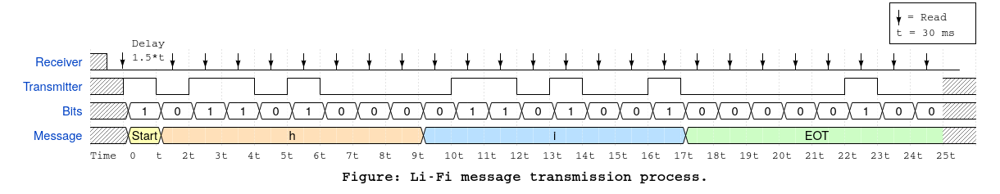

# Li-Fi
Arduino based lifi communication project. Transfer data through light!  
  
**Attention: This project isn't debugged properly due to hardware limitations. Some functions like trasferring binary files may not work properly. Anyone is welcome to test and debug! :)**
    
Use an led to transmit data from one arduino and an ldr/photo-diode in another arduino to receive.  
Upload the transmitter class in transmitter arduino and receiver class in the receiver arduino.  

  
Make sure that you have edited the *config.h* properly in both receiver and transmitter class. See the *transmitter.h* and *reciever.h* file to know about the public members of the classes. If you use an ldr, you can easily use the default code. Otherwise you may need to write a custom function for getting binary output from the sensor and pass it to the class constructor(See the definitions in the header files).  
To run the default code, just simply open the *transmitter.ino* or *receiver.ino* in arduino IDE and click upload. Now you can type message in the serial monitor to send or use the GUI.  
Note that you may have to threshold the analog input value according to the brightness of the room.    

**File Transfer:** Although the data transfer rate is a bit slow, you can send small files as well.
For this, some useful python scripts are included with a simple gui.

### App
Arduino can't read file from your disk. So you need some scripts to send the file to arduino's serial so that it can read the file. The app will do this for you. Also it has a simple guy to make things easier.    

To run the app, You need 2 PCs, one for receiver and one for transmitter. First install python3.x and then the required modules: run `pip install pyserial` in both machines.  
Now connect arduino and upload the arduino code. Then go to the *App/Transmitter* or *App/Receiver* directory, edit the *config.py* files and run *main.py* file. You will see a gui window appear. It will show the logs from the arduino as well the messages. 
You can use the send file or send message button in transmitter to send data. The receiver will automatically show messages or ask you to save file if received.
   
Feel free to read the codes and modify :)